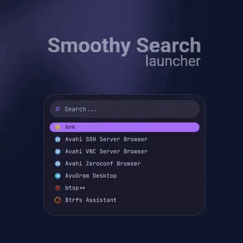

# SmoothySearch

A smooth and minimal app launcher for Linux, built with **Rust** and **Qt/QML**.

---

## Preview

  

---

## Features

- Fast application search
- Quick commands
- Smooth animations
- 14 built-in color presets + 2 examples (My Theme Light/Dark)
- Custom user themes via `themes.toml`

---

## Installation (Arch Linux)

1. 
2. Open a terminal in the folder where the package was downloaded.
3. Install the package:

`sudo pacman -U smoothysearch-0.1.0-1-x86_64.pkg.tar.zst`

---
**Make sure the package name matches the version you downloaded.**

## Run

**Launcher:** `smoothysearch`
**Theme Switcher:** `smoothysearch --themes`

---
**I recommend** creating a `Meta+Space` shortcut to run the `smoothysearch` command.

---

## Guide

